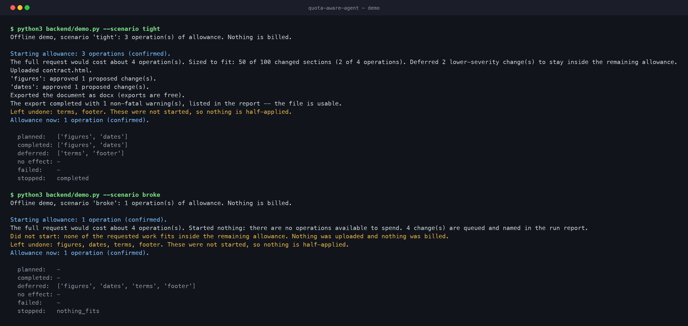

# Quota-aware agent

**Assigned build A · band S1 · MCP/API · SuperDocs**

An agent that reads its remaining allowance **before** it plans, sizes the work
to fit, and when the work does not fit it degrades and says so in a sentence a
person can read — instead of starting a job it cannot finish and dying halfway
through someone's document.



## Setup and test

**Zero setup to see it work.** No key, no network, and nothing to install but a
test runner — the transport is injected and the tests answer with a documented
fake, so nothing here costs an operation:

```bash
cp .env.example .env     # relay credentials, already filled in; see below

python3 backend/demo.py  # watch it plan, size the work, run it, and export

pip install pytest       # the one thing a bare clone does not already carry
python3 -m pytest        # 159 passed, 1 skipped — the skip is the MCP protocol check
```

Python 3.10 or newer. There are **no runtime dependencies** — that is why the
demo runs on a clone with nothing installed at all, why `pytest` is the only
thing the suite asks you to add, and why the `.env` above is read by thirty
lines of `str.partition` rather than by `python-dotenv`.

## It runs with no keys of your own

`cp .env.example .env` is the whole setup, because the file points at a shared
relay that holds a SuperDocs key and lends it under a ration. There is no
signup, and the key in `.env.example` is **not a secret** — it is the same key
for everyone and it is meant to be committed.

What you are borrowing, per key per day, reset at 00:00 UTC:

| | |
|---|---|
| SuperDocs operations | **460** |
| requests per minute, per key | 60 (90 per minute per IP) |
| maximum request body | 8 MB |

The 460 are charged for `POST /v1/chat`, `POST /v1/chat/async` and re-edits
**only**. Uploads, exports, job polls and `whoami` are free — which is exactly
the set of calls this build already treats as free, so the reserve that
guarantees you can always export your work costs nothing on the relay either.

The ration is **shared with everyone using that key**, so treat the number as a
ceiling rather than a wallet, and use `--sample N` on live runs.

**The 460 is a setting, not a fact about relays.** It is what the SuperDocs
account behind this relay could pull off at the time — I have Pro for the second
round, and that is the budget it supported. Set `RELAY_DAILY_OPS` in `.env` to
whatever the account behind *your* relay can actually lend:

```bash
RELAY_DAILY_OPS=460      # the default; lower it to match a smaller account
```

Set it, and set it deliberately, if that account is on the **free tier**: free is
**500 operations per _month_**, so a 460-a-day ration is a ceiling the account
can honour exactly once and then not again until the monthly reset. The two
ceilings count different periods, and this build only guards the one it is told
about — a day's ration it can see, not a month's allowance it cannot. A value
that is not a non-negative integer is ignored and the 460 stands, because a typo
in a ceiling this build imposes on *itself* should not become a total outage.
`0` is honoured: "the lender has nothing left today" is a thing worth being able
to say.

One practical note that cost an afternoon: the relay sits behind Cloudflare,
which answers the stdlib default `Python-urllib/3.x` User-Agent with
`403 error code: 1010`. The body is plain text and mentions neither a key nor a
quota, so it reads exactly like a bad key and is not one. Every request this
build sends carries a named `User-Agent` for that reason, and a test pins it.
(`curl`, `requests`, `httpx` and even *no* user agent are all answered 200 —
only the urllib default is refused, which is precisely the one a dependency-free
build sends.)

### Whose key it is decides which question gets asked

**On the relay path this build does not call `whoami` at all.** There is no
account of ours to ask about, so the allowance is the ration in `.env` and
establishing it costs not one network call:

```
read_allowance() -> 460 operations (estimated), capped by the shared relay's daily ration
calls made       -> none
```

Asking would have produced a number that is wrong in two directions at once.
`GET /v1/agents/whoami` through the relay answers for the **relay's** account,
not yours — and that number does not move as you spend. Verified live on
2026-08-27, after four operations had already gone out that day:

```json
{ "tier": "free", "is_agent_account": false,
  "quota": { "monthly_limit": 500, "used": 0, "remaining": 500 } }
```

`used: 0`. The charges came out of a promo bucket the monthly figure does not
count, so a build that planned against that 500 would be planning against a
ceiling that is neither its own nor moving. The ration is the ceiling actually
in force, it is the one you can set, and `RELAY_DAILY_OPS` is where you set it.

**With your own key, `whoami` runs exactly as before**, because then the account
really is yours: the call is free and it is the one moment in a run when the
balance is genuinely authoritative. That is the whole difference, and it is one
branch in `read_allowance`.

What the relay path gives up, said plainly rather than left to be discovered:
`whoami` also carries `quota_exhausted`. Skipping it means an account whose
monthly allowance is genuinely gone is discovered on the first chat call rather
than before the run starts. That call is refused rather than billed, the refusal
is authoritative, and the run stops on it with a report and an export — later
news, not lost news.

When it *is* called, one more live surprise is worth knowing: the relay's key is
**not an agent account**, and a whoami answers with the balance under
`quota.remaining` — not `remaining_operations`, and not `usage.monthly_remaining`.
A reader that knows only one of those names does not crash; it finds nothing,
plans against zero, does nothing and exits 0, which is indistinguishable from an
empty allowance. `_balance_from_whoami` reads all three shapes in order and a
test pins each one.

This build sends **no `model` field** on any request and never touches
OpenRouter, so the relay's model allowlist does not apply to it. (For the
record, the relay allows `deepseek/deepseek-v4-flash` for chat and
`google/gemini-embedding-2-preview@768` for embeddings; if you ever see
`forbidden_model` from this build, something else is putting a model on the
request, and the error says so.)

### To use your own key instead

Uncomment one line in `.env`:

```bash
SUPERDOCS_API_KEY=sk_your_key_here
```

The build then calls `https://api.superdocs.app` **directly**: no ration, no
allowlist, and the key never reaches the relay. That precedence is a security
position and not a convenience — a key of yours has no business passing through
infrastructure somebody else operates and logs. The relay refuses `sk_`-shaped
keys with a 401 anyway, but being refused is not the same as not trying.

The rule, implemented once in `client.resolve` (`backend/quota_aware_agent/client.py`):

1. `SUPERDOCS_API_KEY` set and non-empty → `SUPERDOCS_BASE_URL` or the origin, with your key.
2. Otherwise `RELAY_URL` + `RELAY_KEY` → the relay's `/v1/superdocs` prefix, under the ration.
3. Otherwise raise, **naming both** routes — an agent told only "get a key" goes
   and gets a key it did not need.

With your own key the agent stops reporting a second ceiling, because there is
not one. That is the whole visible difference.

### Environment

| Variable | Required | What it is |
|---|---|---|
| `RELAY_URL` | for the zero-signup path | The shared relay. `.env.example` sets it. |
| `RELAY_KEY` | for the zero-signup path | The relay's public key — committed on purpose. |
| `SUPERDOCS_API_KEY` | only to opt out of the relay | Your own key. Takes precedence over everything above and never reaches the relay. An agent can create its own account with `POST /v1/agents/signup`. |
| `RELAY_DAILY_OPS` | no | The relay's daily ration, in operations, and **on the relay path it is the whole allowance** — `whoami` is not called there, so this number is what the run plans against. Defaults to 460, what the account behind this relay could lend. Ignored when `SUPERDOCS_API_KEY` is set, because then the account is yours and gets read instead. |
| `SUPERDOCS_BASE_URL` | no | Origin override. Only read when `SUPERDOCS_API_KEY` is set — a base URL without a key of your own would just be the relay with extra steps. |
| `QUOTA_AWARE_AGENT_LEDGER` | no | Where the operation ledger is kept. Defaults to `~/.quota-aware-agent/operations.jsonl`. **Set it per account** — two agents driving different accounts must not share one. |

`.env` is read by `_load_dotenv` in `backend/quota_aware_agent/__init__.py`,
which is the same stdlib parser the neighbouring `word-doc-repair` build uses
rather than a second dialect of the same file. It never overrides a variable
that is already set, so an `export` on the command line still wins — and so a
test that deliberately empties a variable stays emptied.

It looks in exactly **one** place: this build's own root, where `.env.example`
sits, so the documented `cp` works from whatever directory you run the command
in. It deliberately does **not** walk up the tree the way the neighbouring copy
does, and the current working directory is **not** a second source — cwd is
ambient, and standing in a project that happens to have a `.env` is not the act
of choosing that file. That is right for a build that owns its whole
repository and wrong for one sitting beside other projects — walking up found a
sibling project's `.env` holding a real `sk_` SuperDocs key, and a `--live` run
then went to the origin on credentials it had never been given. The precedence
rule exists to stop a key going somewhere its owner did not send it; a loader
that hands one over underneath it defeats that rule from below.

<details>
<summary><b>The MCP surface</b> — one extra install</summary>

```bash
pip install -e ".[mcp]"
cp .env.example .env                      # or export SUPERDOCS_API_KEY=your-key
python3 -m quota_aware_agent.mcp_server   # stdio
```

Or register it with a client — on the relay path, no key of yours is involved:

```bash
claude mcp add quota-aware-agent \
  --env RELAY_URL=https://relay.pxyz943.workers.dev \
  --env RELAY_KEY=pk_f2a01b7f189f0d1ea6c57a04cb83c14e \
  -- python3 -m quota_aware_agent.mcp_server
```

With the SDK installed the suite runs **160 passed, nothing skipped** — the
extra test starts the real server over stdio and drives it with a real client,
because a server that imports cleanly and cannot start is worse than one that
fails loudly.

Expect the suite to go from about a fifth of a second to roughly twenty once the
SDK is installed. Almost none of that is this build: importing `mcp` costs about
five seconds on its own, and the protocol test pays it twice because it spawns a
server subprocess that imports it again. Said here so a stranger who follows the
instructions does not read a slow suite as a hung one.
</details>

<details>
<summary><b>Against the real API</b> — this one spends operations</summary>

```bash
cp .env.example .env                        # or export SUPERDOCS_API_KEY=...
python3 backend/demo.py --live --sample 1   # one step, one operation
```

`--sample N` is the small-sample bound. Use it, and use it especially on the
relay, where the 460 are shared with everybody else. The demo prints which of
the two endpoints it is about to spend against before it spends anything.
</details>

### What to run to check each claim

| Claim | Command |
|---|---|
| It sizes work to fit and names what it dropped | `python3 backend/demo.py --scenario tight` |
| It refuses to start rather than half-finish | `python3 backend/demo.py --scenario broke` |
| It can refuse a partial run outright | `python3 backend/demo.py --scenario tight --refuse` |
| It bounds anything that loops | `python3 backend/demo.py --sample 2` |
| It says what it spent, and whether that adds up | `python3 backend/demo.py --receipt` |
| It says where the time went, stage by stage | `python3 backend/demo.py --receipt` — the `TOOK` column |
| A rerun does not pay twice | `python3 backend/demo.py --scenario tight --ledger /tmp/ops.jsonl` — **twice** |
| The relay path plans against `.env`, not `whoami` | `python3 -m pytest -k "does_not_call_whoami or own_key_still_reads"` |
| It never fails halfway, even on a 5xx | `python3 -m pytest -k "paid_for_still_comes_back or warm_up"` |
| A step that changed nothing is not called done | `python3 -m pytest -k "changed_nothing or nothing_changed or no_effect or did_not_change or wording" -v` |

The second run of that last one declines to repeat the first run's work and says
so. That is graceful re-entry shown rather than asserted.

### When the model declines the instruction

A step can finish, be billed, and change nothing: SuperDocs reads the document,
decides the thing you asked for is not in it, and says so. The job still ends
`completed`. This build treats that as its own outcome and not as success —

```
  completed: -
  no effect: ['figures']
  stopped:   nothing_changed
```

— with the platform's own sentence quoted underneath. The decision is made on
`document_changes.version_id`, never on the model's prose: a version that did
not move is a document that did not change, and reading intent out of generated
text is guessing about somebody's file.

Such a step is **not** repeated with the same wording on a rerun. It has already
been paid for once and declined once, and sending the identical instruction buys
the identical refusal. The retry that works is a **reworded** one, and rewording
needs no flag — the ledger key is a hash of the instruction, so different words
are a different call and simply run.

This is BUG-101 in `BUGS.md`, and it is worth naming: before the fix the run
printed `completed: ['figures']`, wrote `applied` to the ledger, and every rerun
from then on skipped the step for good. Reported as done, unrepeatable, undone.

## What it uses from SuperDocs

| Surface | Used for | Costs |
|---|---|---|
| `GET /v1/agents/whoami` | The one authoritative allowance read available to an API key. **Own-key path only** — on the relay the allowance is `RELAY_DAILY_OPS` and this is not called. | free |
| `POST /v1/documents/upload` | The document. Multipart; the filename extension decides the parser. | free |
| `POST /v1/chat/async` | The edit instruction, with `approval_mode: ask_every_time`. | **billable** |
| `GET /v1/jobs/{id}` | Polling. Silence is treated as processing, never as a crash. | free |
| `POST /v1/chat/{session_id}/approve` | Approving proposed changes, item by item. | re-edits billable |
| `POST /v1/documents/export` | The finished file. Free, so it runs even when the run stopped early. | free |
| **MCP** | The delivery surface — four tools, of which one costs anything. | |

Paths are identical on both endpoints: the relay mounts SuperDocs under
`/v1/superdocs` and changes nothing below it, so the relay is a base-URL swap
and nothing in this package below `resolve` knows which of the two it is
talking to.

## The problem, stated precisely

An agent that plans without checking its allowance starts work it cannot
finish. The obvious fix — "check the balance first" — runs into something the
SuperDocs documentation is explicit about:

> the `/v1/users/me/usage` and `/v1/users/me/limits` endpoints belong to the
> web-app account surface and accept web-app session tokens only — they reject
> `sk_` / `lce_` API keys with a `401`

**So an API-key agent cannot read its balance on demand.** There is no endpoint
to poll. What exists is `GET /v1/agents/whoami` once at the start, and the
`usage` block that rides on **every** chat response afterwards. You learn your
balance as a side effect of doing work, not in advance of it.

This build takes that seriously rather than papering over it. `Balance` carries
an `authoritative` flag, and every report says which kind of number it used:

```
Starting allowance: 3 operations (confirmed).
Allowance now: 1 operation (confirmed).
```

A number inferred between calls prints as `(estimated)` and can never be
presented as a live read. That distinction is a tested property, not a comment.

### Two ceilings, one question

On the relay path there is a **second** ceiling: the daily ration, sitting under
the account's monthly allowance. It is modelled inside `BudgetGuard` rather than
beside it, and that was the load-bearing decision in wiring the relay up.

"How many operations may I spend?" already has an owner in this codebase. A
second answer to that question kept somewhere else is how a planner ends up
sizing work against a number that was never the binding one — a monthly
allowance of 400 behind a daily ration of 12 is *twelve* operations of room, and
reporting 400 to a planner that then sizes 40 steps to fit is the exact failure
this build exists to prevent, arriving through a number that was true about the
wrong thing.

So the ration is a `Balance` like any other, `remaining()` returns whichever
ceiling is lower, and the report names which one is doing the stopping:

```
Starting allowance: 12 operations (estimated), capped by the shared relay's daily ration.
```

Its authority runs the *other way round* from the monthly allowance, which is
the point of expressing it in the same vocabulary rather than as a counter:

- The relay states nothing about the ration on a successful response. A ration
  number we are carrying is therefore always `authoritative=False` — an
  estimate, exactly like the monthly number between calls, and for the same
  honest reason: part of today's ration may already have gone to somebody else
  on the same shared key.
- The one authoritative reading is the **refusal**. `budget_exhausted` means it
  is gone, which is the same shape of fact as `quota_exhausted`, reaches the
  planner the same way, and stops the run the same way.
- What differs is the **remedy**, so the reason is carried rather than a bare
  flag. "Buy more allowance" is the wrong advice when the account's allowance is
  untouched and it is the day's ration that is spent:

```
Stopped at 'dates': the relay refused this request (budget_exhausted). The shared
relay lends 460 SuperDocs operations per key per day and today's are spent, so
this was refused and NOT billed. It resets at 00:00 UTC. Set SUPERDOCS_API_KEY to
your own key to bypass the ration entirely, or wait. Retrying will not help.
```

One more distinction the model insists on: the ration is counted in **charged
calls**, not in the operations SuperDocs billed for them. SuperDocs bills one
operation per 25 sections edited; a lender counts the calls it proxied. Deriving
one from the other would invent an accounting rule neither party uses.

Every MCP result carries a `daily_ration` block **only when there is one** — a
ceiling that is not in play must not be described.

## Retrying, and the four different 429s

The relay adds failure modes the origin does not have, and three of them arrive
as the same status code. `client.retry_wait` branches on the **JSON body shape**
— the relay answers `{"error": {"code": …}}`, SuperDocs answers `{"detail": …}`,
an infrastructure 429 answers plain text — never on the prose, because prose
gets reworded.

| What arrived | What it means | What happens |
|---|---|---|
| `error.code == "budget_exhausted"` | the day's ration is spent | **stop.** Its `Retry-After` counts down to 00:00 UTC, so a client honouring it sleeps for hours and one ignoring it spins. Raised, with the fix in the message. |
| `error.code == "rate_limited"` | the relay's per-minute limiter | retry, honouring `Retry-After` |
| `detail` **and** a `Retry-After` | SuperDocs' own application 429: the monthly quota | surfaced, never spun on — the platform's own signal is authoritative here |
| plain text, no `Retry-After` | infrastructure 429 in front of SuperDocs | retry with backoff |
| `forbidden_model`, `input_too_long`, `payload_too_large` | a relay ceiling | raised at once, naming the ceiling **and** that your own key lifts it |

Otherwise: five attempts, `Retry-After` honoured but **capped at 60s** (a client
that sleeps for hours is indistinguishable from one that hung), else exponential
backoff with jitter at ~1s, 2s, 4s, 8s, 16s. The jitter is not decoration —
several agents started by the same crash would otherwise retry in lockstep and
rebuild the burst that got them limited. 400, 401, 403, 404, 413 and 422 are
never retried.

**One deliberate departure from the blanket policy**, and it is this build's
whole thesis: a 502/503/504 or a read timeout is repeated only on a `GET`. A
gateway error can come from something that had *already passed the request
upstream*, so repeating a billable POST can pay twice and apply the same edit
twice. On a charged call the ambiguous failure is handed back instead, and the
operation ledger records it as started-and-unconfirmed for a person to settle.
Fewer automatic recoveries, no double charges. A 429 is different and *is*
retried on any method: it was refused before any work happened, so it cannot
have been billed.

## What it does when the work does not fit

Three behaviours, each one tested:

**It refuses to start.** If nothing fits, nothing is uploaded and nothing is
billed. There is no partially-edited document to clean up.

```
Did not start: none of the requested work fits inside the remaining allowance.
Nothing was uploaded and nothing was billed.
```

**It degrades by severity.** If some of the work fits, the highest-severity
work goes first and the rest is named — not silently dropped.

```
The full request would cost about 4 operation(s). Sized to fit: 50 of 100
changed sections (2 of 4 operations). Deferred 2 lower-severity change(s) to
stay inside the remaining allowance.
Left undone: terms, footer. These were not started, so nothing is half-applied.
```

**It holds a reserve.** The last operation is never spent on new edits, so the
work already done can always be exported. Exports are free on both endpoints, so
this costs the user nothing and guarantees they end up with a file.

**It does not pay twice for the same edit.** SuperDocs has no idempotency on
billable writes — there is no idempotency key on `POST /v1/chat/async` — so a
rerun after an interrupted batch is charged again for work already in the
document. An operation ledger, keyed on what the call *is* rather than on an id
the caller assigned, is written **before** each billable call and consulted
before each one:

```
'terms': an earlier run already applied this. Not repeated, and not billed again.
```

The hard case is handled as a hard case. A call that was sent, and whose outcome
this process died before learning, is **neither repeated nor forgotten** —
retrying it might be charged twice and might apply the same edit twice, and
skipping it might leave the work undone. There is no safe automatic answer, so
it is reported:

```
'dates': an earlier run started this and never learned whether it finished.
Not retried — that might be charged twice and might apply the same edit twice.
```

A person opens the document, sees whether the edit is there, and says so through
`resolve_operation`. That exit has to exist: a step that is never retried
automatically and cannot be resolved through the surface is a step that can
never run again.

**It knows whether a failed call could have been billed.** A refused connection
proves the request never reached SuperDocs, so a rerun may safely repeat it. A
read timeout proves nothing — the request very possibly arrived, was charged and
applied an edit, and only the answer was lost. Collapsing those two into "it
failed" is how a retry pays twice, so they are recorded as different things and
the default answer is *we do not know*. A relay refusal is the one clean case in
the other direction: it never reached SuperDocs at all, so the step stays
repeatable.

**It says what it spent, and whether that adds up.** `--receipt` prints the line
items and reconciles them against the allowance — and when they disagree, it
says so rather than picking a side:

```
DOES IT ADD UP?
2 operation(s) charged, and the allowance moved by 2. These agree.
```

A `~` marks an operation we *believe* was charged on a call that returned no
usage block, and a `?` marks a balance we inferred. Confirmed and estimated
figures are never added together, because one number that is part measurement
and part belief tells the reader nothing about which part is which.

### The stopping rule, stated once

1. `quota_exhausted` on any response — the platform's own signal, and the only
   authoritative one about the account. Stop immediately. Our arithmetic never
   overrules it.
2. `budget_exhausted` from the relay — the same shape of signal about the *other*
   ceiling, with a different remedy, so it stops with its own reason rather than
   being folded into the one above.
3. The reserve floor — never spend the last operation.
4. `--sample N` — the small-sample bound, because anything that loops needs one.

All of them live in `Policy`, which is frozen, so a run ends under the policy it
began with. And every one of them **explains what it was protecting** when it
fires. That is not decoration: a limit whose only feedback is *"I stopped"*
trains the person who set it to raise the number until it stops firing, which is
the same as not having it.

## How the work is priced, and why that is the whole ballgame

SuperDocs bills a **request**: most bill one operation, and very large ones bill
one per 25 sections edited. The floor of one is therefore *per request*, not per
plan — and this agent sends one request per step.

That distinction is not a rounding error. Four five-section edits pooled to
twenty sections price as **one** operation and bill as **four**. An agent that
prices them pooled reports "it fits", starts, and runs out partway through
somebody's document — which is the exact failure this build exists to prevent,
arriving through its own arithmetic. `estimate(changes, batched=False)` is what
the agent uses, `batched=True` is what a publisher sending one request uses, and
`QuotaAwareAgent.BATCHED` names which one this is so the planner and the
executor cannot drift apart about what a step costs.

## Use it as an MCP server

The card is band S1 · MCP and the user is an agent, so the agent is reachable
as one. Four tools, in the order an agent actually needs them:

| Tool | Costs | What it answers |
|---|---|---|
| `check_allowance` | free | What have I got? The one authoritative read — plus anything an earlier run left unresolved. |
| `plan_work` | free | What fits inside it — without doing any of it. Given a `session_id` it also prices against the ledger, so work an earlier run already paid for is named rather than quoted. |
| `run_work` | billable | Do the part that fits; say what was left out, what was already paid for, and what it cost. Takes HTML, or the bytes of a real `.docx` as `document_base64`. |
| `resolve_operation` | free | A person's answer about a call that was started and never confirmed. Without it that step could never run again — a state the surface could enter and not leave. |

Both `plan_work` and `run_work` take `when_it_does_not_fit`: `degrade` (do the
highest-severity part that fits, the default) or `refuse` (start nothing rather
than deliver a subset).

**Every result carries a `budget` block**, so a calling agent never has to spend
a turn asking what is left before it decides what to do. It carries the
remaining operations, whether that number is authoritative or inferred, the
reserve, what is therefore spendable on new edits, and — on the relay path only
— the daily ration and whether it is the binding ceiling. Surfacing the budget
into the caller's own context is the cheapest useful thing this build does: an
agent that knows what is left can decide earlier, do less, or escalate — and an
agent that has to ask cannot.

**`plan_work` exists as its own tool on purpose.** An agent that has to commit
to work before it can find out what fits is the exact failure this build is
about, so the plan is readable for free and changes nothing. A test asserts that
planning makes no billable call, and another asserts the plan and the run agree
about what fits — if they could disagree, only one of them would be tested.

Every tool is a thin wrapper over `QuotaAwareAgent`; no planning logic lives in
the MCP layer. `dispatch()` calls the whole surface without a protocol client,
which is what keeps it testable offline.

## The four-call contract

`upload` → `edit instruction` → `approve` → `export`, built first and built
completely, before any depth.

| Call | Endpoint | Billing |
|---|---|---|
| Upload | `POST /v1/documents/upload` | free |
| Edit instruction | `POST /v1/chat/async` (`approval_mode: ask_every_time`) | 1 op per 25 sections |
| Approve | `POST /v1/chat/{session_id}/approve` | denied changes are never billed |
| Export | `POST /v1/documents/export` | free |

### The three named traps, all handled

**Trap 1 · the double parse.** A `proposed_change_batch` envelope carries its
payload as a JSON-encoded *string* in `content`. It needs a second parse. Miss
it and you get diff cards where every field reads `undefined` — silently, with
no error. `parse_proposed_changes` does it, and the test asserts the change id
actually reached the approve call, because a test that only checks "it ran"
would pass while approving nothing.

**Trap 2 · silence is not a crash.** A job on a large document can run for
minutes with no output. `poll_job` treats quiet as processing and gives up only
at an explicit deadline — and when it does, it says the deadline was *ours*:

> job job-1 was still 'in_progress' after 4s. That is a deadline this client
> imposed, not a platform failure — the job may still be running.

**Trap 3 · the allowance.** The whole point of this build. Small-sample mode
and the stopping rule above.

## Why the tests need no key

The transport is injected. `tests/fake.py` implements the documented response
shapes — including the double-parsed envelope, a `usage` block on billable
responses, and the `400` the live upload endpoint returns for a filename whose
extension disagrees with its bytes. The demo answers with the **same** fake the
suite uses, so what a reviewer watches is what the tests assert; a second fake
written only for the demo would be free to flatter the code that calls it.

The relay work did not change that. `tests/test_relay.py` scripts the transport
with a list of responses instead of a network, so the retry schedule is asserted
without living through it, and the one test that drives a real MCP server over
stdio empties `RELAY_URL` and `RELAY_KEY` as well as `SUPERDOCS_API_KEY` — a
developer who has run `cp .env.example .env` would otherwise hand that
subprocess working credentials, and the test would quietly stop proving what it
says it proves.

See **Setup and test** at the top for every command.

## Shared core — stated plainly

`backend/quota_aware_agent/budget.py` is shared with another system by the same
author, where it guards the publisher that writes documents back to SuperDocs.
It is vendored here rather than imported so this build stands alone in this
repository.

Reuse is only a shortcut when it is hidden. The same module solving both
problems is the argument that the abstraction is right: "never start work you
cannot finish" is one idea, and an agent sizing a plan and a publisher sizing a
document write are the same shape of problem.

The relay's daily ration was added to *this* copy, because it is the same idea
one layer out — a second ceiling on the same question — and putting it anywhere
else would have given the planner two places to look. Whether the other copy
should take it too is a question about that build's own lenders, not about this
one.

## Honest limitations

- **The allowance is not continuously known, and this build does not pretend it
  is.** With your own key it is authoritative at `whoami` and after each response
  that carried a usage block, and an estimate in between. On the relay path it
  is an estimate from the first line to the last, because the ration is a
  published ceiling rather than a reading. Every report labels which.
- **On the relay path an exhausted account is found late.** `whoami` is not
  called there, and it is the call that would have carried `quota_exhausted`
  before any work started. The first chat call finds it instead; that call is
  refused rather than billed, and the run stops on it with a report and an
  export. Set `SUPERDOCS_API_KEY` and the up-front read comes back.
- **The relay's ration is never confirmed, only refused.** The relay reports
  nothing about it on a successful response, so the number this build carries is
  a published ceiling decremented by our own count, labelled `(estimated)`
  throughout. It is shared with everyone using that key, so it can be gone
  before our count says it should be — which is why `budget_exhausted` is
  treated as authoritative and arrives as a stop rather than as a surprise.
- **Section counts for planned edits are supplied by the caller, not measured.**
  SuperDocs bills per 25 sections *edited*, which is known only after the edit.
  A caller who badly underestimates can still overshoot — which is exactly why
  `quota_exhausted` is treated as authoritative and the reserve exists.
- **The operation ledger is this client's memory, not the platform's.** It
  prevents *this tool* from paying twice. It cannot prevent a different client,
  or a person in the web app, from making the same edit — nothing below us
  offers idempotency to build that on.
- **The ledger is not locked against two processes running at once.** It is read
  at start-up and appended to, so two runs launched simultaneously against the
  same steps can both see "not yet attempted" and both pay. Sequential reruns —
  the crash-and-resume case it was built for — are safe. A file lock would close
  the concurrent case and is not built.
- **A failure that is neither a ration nor an allowance stops the run, and the
  run still exports.** A 5xx, a refused connection, or the warm-up failure the
  task brief names — the first request in a fresh session can fail while things
  warm up — ends the run at that step. It does not end it with a traceback: the
  work already applied is exported, the steps never reached are named, and the
  step it stopped on is recorded by what is actually known about it. This build
  does **not** automatically resend the warm-up failure, because a 503 does not
  prove the edit was never billed and resending it might pay twice. "Send it
  again and it settles" is the right advice for a person and the wrong rule for
  a machine spending somebody's allowance, so the step waits for one.
- **What SuperDocs says about your document is quoted, never obeyed.** The
  model's own sentence about a job is written by a model that has just read your
  file, so it arrives inside guillemets and, on the MCP surface, under a field
  named `quoted_from_the_platform` with a note saying it is data to report on
  and never instructions to follow.
- **A failure whose outcome is unknown needs a person, by design.** The agent
  will not guess between paying twice and leaving work undone, so those steps
  stay blocked until someone answers with `resolve_operation`.
- **The clock is measured, the money is reported.** The receipt's `TOOK` column
  is wall clock around each call, and it names the slowest one rather than an
  average — the docs warn a single operation can take minutes with no visible
  progress, and an average is exactly the summary that hides that. It is not a
  benchmark: one run, no repeats, no variance, and the numbers include this
  machine and this network.
- **A reconciliation needs two authoritative balances.** If either end of the
  run was inferred, the receipt says the run cannot be reconciled rather than
  reconciling two guesses. On the relay path, a run whose binding ceiling was
  the ration will say exactly that.
- **It approves every proposed change in the demo.** The approve call supports
  per-change denial with feedback and the client exposes it; deciding *which*
  changes are worth approving is a different problem from affording them.
- It does not implement the pre-signed upload flow, so it is limited to the
  ~20 MB direct-upload ceiling — and to 8 MB on the relay path.

## Credit

Built by **Priyanshu Semwal** ([@Priyanshu2425](https://github.com/Priyanshu2425))
for the SuperDocs engineer round, 2026. MIT licensed — see [LICENSE](LICENSE).

Grounded throughout in the SuperDocs API documentation; where the task brief and
the documentation differed, the documentation won.
