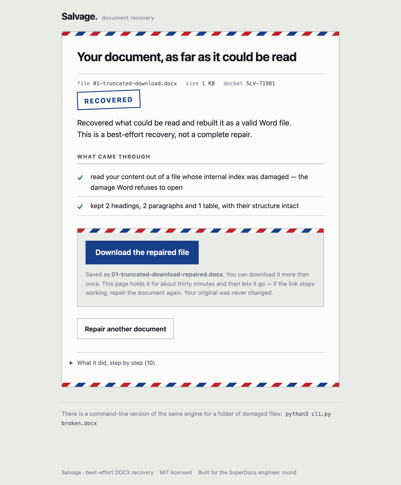

# Salvage — repair my broken Word doc

**Assigned build B · band S2 · API + export · SuperDocs**

A `.docx` that will not open leaves its owner with nothing — Word says the file
is corrupt and offers no way forward. Drop it on this page and you get back a
clean, styled Word file, plus a plain account of what came through and what did
not.



## What it does

It opens the file the way Word will not, takes out whatever is still readable,
and rebuilds a valid document around it.

A `.docx` is a ZIP of XML parts, and it breaks in a handful of recognisable
ways. Each one needs a different move:

| What is wrong | What it does about it |
|---|---|
| The file's index is damaged or the download was cut short | Reads the internal file headers directly and inflates each part by hand. The index lives at the *end* of the file, so it is the first thing a truncated download loses — while the content itself is usually still there. |
| The document body is malformed — a stray `&`, an invalid character, a tag left open by the cut | Repairs each fault, then closes any elements still open at the end. It never reorders or invents content. |
| Structural parts are missing | Regenerates them. They are standard plumbing and carry none of your content, which is why the report does not list them as a loss. |
| Your pictures are in there somewhere | Carries them back into the rebuilt file. Images are separate members of the archive with their own headers, so they survive exactly the damage that destroys the index — and when the part that said *where* each one belonged did not survive, they go at the end under a heading rather than being placed somewhere plausible and wrong. |
| Footnotes, headers and footers | Recovered as text and set down at the end, each under its own heading. A footnote folded silently into the body would change what the document says. |
| The body is too damaged to parse at all | Falls back to pulling the text out run by run — and **says so**, because you are getting words back without headings or tables, and finding that out later is the failure this tool exists to prevent. |
| The main document part is gone entirely | Says it cannot be repaired. Nothing is invented to fill the gap. |

## What it promises, and what it does not

It never claims a complete repair. A test asserts that — it fails the build if
the words *fully repaired*, *guaranteed*, *perfect* or *100%* appear anywhere in
any output the user can see.

**And it shows you the document before you take it.** The rebuilt file is
rendered on the page — headings, tables, and the pictures — above the download
button, because the question *was any of this worth it* is one people ask before
they act. This is the part of the page whose honesty needs no wording at all:

> It ran for a bit and then wanted forty dollars to download the result. It just
> said "repair successful". I didn't know if it had actually got anything.

Three things it will always do:

- **Name what it lost.** Structure that could not be preserved, parts cut short
  by the damage, content that was not there to recover.
- **Refuse to call an empty file a success.** A valid document with nothing in it
  is the most dangerous possible output — it opens cleanly, so the owner may not
  notice their content is gone for weeks. That is reported as a failure.
- **Tell you to keep the original.** It is on the result screen, every time.

## What it uses from SuperDocs

| Surface | Used for |
|---|---|
| **REST API** — `POST /v1/documents/upload` | Sending the recovered structure up as clean HTML |
| **Chat editing** — `POST /v1/chat/async` | One edit instruction: restore formatting, change no content |
| **Human-in-the-loop approval** — `POST /v1/chat/{session_id}/approve` | Approving each proposed change, with the second parse its payload requires |
| **Export** — `POST /v1/documents/export` | Getting a styled `.docx` back |

All four are optional. The local rebuild is the default and needs no key, no
network and no account — and **every failure on the SuperDocs path degrades back
to it**, which a test asserts for each failure in turn. Details under
[Where SuperDocs fits](#where-superdocs-fits).

## Run it

The web page — this is the product:

```
pip install -e ".[web]"
python3 -m docrepair.web          # then open http://127.0.0.1:8000
PORT=8077 python3 -m docrepair.web  # if 8000 is taken
```

The page is React and TypeScript, and **you do not need Node to run it** — the
build emits one self-contained file into `static/`, and that file is committed.

The tests, which need nothing installed and no key:

```
python3 -m pytest                 # 55 tests, offline
```

To work on the page itself:

```
cd frontend
npm install
npm test                          # 36 tests
npm run build                     # rewrites static/index.html
```

Those 36 tests render the whole page and answer it with repair streams recorded
from the real engine by `tests/test_frontend_fixtures.py`, which fails if the
recordings drift. The honesty guards — no engine vocabulary, no promise of a
complete repair, no "what came through" on a total failure — run over what is
actually on the screen, for all ten recorded repairs. They used to run over
the engine's strings, which is how BUG-014 was fixed and came straight back as
BUG-020: a page can introduce copy the engine never produced.

And a CLI, for a folder full of them. The engine is identical; the page is the
product and this is the back door:

```
python3 cli.py broken.docx
python3 cli.py *.docx --quiet
```

## How it is tested

Every test starts from a **real** DOCX this package wrote, then breaks it in one
specific way — truncated container, missing content-types part, unclosed tags,
bare ampersands and control characters, missing document part, not a ZIP at all,
empty body, and an illustrated document both whole and cut short. The assertion is not "it did not crash": the output is reopened as a
ZIP, every required part is checked, the body is re-parsed, and the recovered
table is compared cell by cell against the original.

The tests that matter most are the ones about honesty:

- a missing document part **fails**, and says why
- an empty body is a **failure**, not a success with no content
- no user-visible string overclaims
- structural parts the tool rebuilds are never reported as lost content
- the user-facing lists contain no jargon — no `ZIP`, `XML`, `CRC`, or
  `central directory` leaking out of the engine into a worried person's summary

## Where SuperDocs fits

The four-call contract — upload · edit instruction · approve · export — is built
and tested in `docrepair/styled_export.py`, and runs as an optional second pass:

```
export SUPERDOCS_API_KEY=your-key-here
python3 cli.py broken.docx --via-superdocs
```

Recovered structure goes out as clean **HTML**, never raw Word XML — the docs are
explicit that there is no endpoint for the latter — so headings stay headings and
tables stay tables. The edit instruction restores formatting and forbids content
changes; each proposed change is approved through the HITL endpoint (with the
second parse the payload requires); the export comes back as a styled DOCX.

**Every failure on this path degrades to the local rebuild**, and a test asserts
it for each one: a dead network, an exhausted allowance, no job id, an empty
export, or any unexpected exception. The engine has already produced a valid file
before this runs, and nothing here is allowed to take that away from the user.

**The local rebuild is the default, and that is deliberate.** Someone whose
document is broken should not have to hand it to a third-party service, or wait
on an API, to find out whether anything survived. The offline path answers that
in milliseconds and costs nothing; the SuperDocs path is for producing a
polished, fully-styled export once you know there is something worth styling.

Session state and uploads are held in memory for one download and then dropped.
Nothing is written to disk and nothing is retained.

## Honest limitations

- **The rebuilt file is deliberately plain.** Your original theme, fonts and
  spacing cannot be recovered from a broken file, so it rebuilds with clean
  headings, tables and body text rather than guessing at a design you had.
- **Pictures come back; their captions and wrapping do not.** An image is placed
  inline where the body referenced it, or at the end when nothing survived to
  say where it belonged. Floating positions, text wrap and captions are gone.
- **Footnotes, headers and footers come back as text, not as page furniture.** A
  rebuild cannot put a footnote back at the foot of the page it belonged to, so
  their text is set down at the end under its own heading and the report says so.
- **An image whose header cannot be read is placed at a stated default size**
  rather than at a measurement nobody took. Its aspect ratio is left alone.
- **Comments and tracked changes are not recovered.**
- Direct upload only, so the practical ceiling is about 20 MB.
- `.doc` (the pre-2007 binary format) is not a ZIP at all and is not supported —
  it is reported as unrepairable rather than silently mangled.

## Testing it by hand

The automated suite proves the engine does the right thing. It cannot tell you
whether the downloaded file opens in Word, whether the progress is perceptible,
or whether a non-technical person understands what they got back.

`manual-test/index.html` is a checklist for exactly that — open it in a second
tab. Nineteen items: eight deliberately broken fixtures with their expected
results transcribed from real runs, four edge cases, and seven judgement calls
no test can make. Verdicts and notes persist across reloads, and it exports the
results as Markdown.

Writing it found three defects the suite had missed: a total failure still
rendered a "what came through" claim, one problem was reported twice, and an
exception class name leaked into a stage line. All three are fixed, and the
suite now guards the stage log as well as the summary.

## Shared code — stated plainly

`docrepair/superdocs_client.py` is the same four-call client used by the
quota-aware agent (assigned build A). It is vendored into both so each stands
alone in the builds repository. Reuse is only a shortcut when it is hidden.

## Credit

Built by **Priyanshu Semwal** ([@Priyanshu2425](https://github.com/Priyanshu2425))
for the SuperDocs engineer round, 2026. MIT licensed — see [LICENSE](LICENSE).

Grounded throughout in the SuperDocs API documentation; where the task brief and
the documentation differed, the documentation won.
