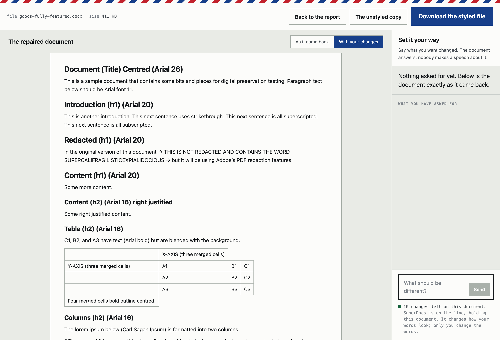

# Salvage — repair a broken Word document

A `.docx` that will not open, re-ingested, rebuilt, and handed back as a valid,
styled Word file — with a plain account of what was recovered and what was not.

Built for the SuperDocs engineer task, assigned build B. It is built **on**
SuperDocs, not a version of it: the recovery is local, and SuperDocs does the
styling.

> **Best effort, and it says so.** Not every corrupted file can be repaired.
> When the words are not in the file, this tool refuses and says why rather than
> inventing something to fill the gap.


## What it does

1. **Re-ingest.** Reads the parts out of the container by hand, going around the
   ZIP index rather than through it — a truncated download loses the index
   first, which is the damage Word reports as a corrupt file.
2. **Normalize.** Repairs the body XML far enough to parse, then reads back the
   headings, paragraphs, tables and pictures that survived.
3. **Export a clean, styled file.** The rebuild is written as a valid package
   and sent to SuperDocs, which returns it styled. That styled file is what you
   get; the plain rebuild stays one click away.
4. **Tell you what happened.** Word count, pictures recovered, pictures that
   could not be, and the rebuilt document itself rendered on the page before you
   decide whether to download it.
5. **Let you set it your way.** The file arrives already styled — but if that is
   not how you would have set it, say so in your own words and watch it change.



### The counter

A door beside the download, opening a conversation with SuperDocs about the
document it just styled. Ask for smaller headings, tighter spacing, hairline
table rules; the document answers and the sheet updates.

Three things it does that a chat window normally does not:

- **It shows the change, not a claim about it.** After a turn the page renders
  SuperDocs' own markup, so a formatting change is visible rather than asserted.
  A toggle puts *as it came back* beside *with your changes*.
- **It never asks the same thing twice.** A turn that cannot be confirmed is
  reconciled against the document's version id and resent only if it did not
  land — because there is no idempotency key on a write, and a retry can apply
  the same edit twice to a document somebody is trying to get back intact.
- **It says what it did.** Nothing at the counter is refused for what you asked
  for, and nothing changes silently: a turn that altered the wording reports it.

The conversation lives for thirty minutes of quiet, then it and the file are let
go — the retention the page has always promised, now actually swept.

The pictures are the part people lose, so they are the part this build is most
careful about — carried across with their bytes unchanged, put back where the
relationships say they belonged, and set at the end under their own heading when
that cannot be known.

## Run it

Nothing here needs a key. The styling pass does; without one you get the plain
rebuild and a line saying so.

```bash
python3 -m venv .venv && ./.venv/bin/pip install -e ".[web,dev]"

# the page
PYTHONPATH=backend ./.venv/bin/python -m docrepair.web     # http://127.0.0.1:8000

# the same engine, in a terminal
PYTHONPATH=backend ./.venv/bin/python backend/cli.py broken.docx
PYTHONPATH=backend ./.venv/bin/python backend/cli.py broken.docx --local-only
```

For the styling pass, put your key in `.env` at the project root:

```
SUPERDOCS_API_KEY=sk_...
```

## Try it on something broken

`manual-test/fixtures/` holds eight deliberately damaged documents, each broken
in one named way — a truncated download, a missing content-types part, unclosed
tags, a file that was never a Word document. Drop any of them on the page.

## What it accepts

**Format:** `.docx` only, up to 20 MB. A `.doc` is a different, older format —
open it in Word once and save it as `.docx` first, and if Word will not open it
either then this tool cannot recover it. **Domain:** none. Damage is structural,
so the words in the document are not this tool's business.

## The numbers

**87 fixtures: 5 base documents × 18 damage modes.** Three of the five base
documents were written by other software — Apple `textutil`, the OPF
`variations` converter, Google Docs — because a repair tool measured only
against its own output is measured against its own assumptions.

```
kind         n   mean recall     min   verdicts
lossless    40         1.000   1.000   full=40
lossy       27         0.644   0.000   full=8 partial=12 refused=7
fatal       20         0.003   0.000   partial=4 refused=16

  empty successes    0        crashes    0
```

**On damage that destroyed no content, every word came back: 40 out of 40.**
That is the number worth quoting, because a shortfall there would be nobody's
fault but this tool's. The method is stated before the result, and the
per-mode breakdown, the caveats and what is deliberately *not* measured are in
**[RECOVERY.md](RECOVERY.md)**.

Reproduce it in one command, with no key and no network:

```bash
PYTHONPATH=backend ./.venv/bin/python -m docrepair.measure
```

## Tests

**169 Python tests and 57 on the page. No key, no network.**

```bash
./.venv/bin/python -m pytest tests/ -q      # 169
cd frontend && npm install && npx vitest run # 57
```

The offline claim is checked the strong way rather than the convenient one: the
suite passes with `SUPERDOCS_API_KEY` unset **and every socket blocked**. A
suite that merely spends nothing has proved it is cheap, not that it is offline.

They name real behaviours rather than proving the mocks work: a picture survives
a 90% truncation; a hostile member name still produces a package that opens; a
half-read picture is refused rather than embedded; a styled file that came back
with the wording changed is thrown away; a contraction is never mistaken for
somebody supplying their own words; a timed-out turn reconciles instead of
sending twice. The picture tests are mutation-checked — breaking each fix in
turn must turn its test red.

## Reading order

| | |
|---|---|
| **[BASELINE.md](BASELINE.md)** | What the system does, as invariants. **Start here before changing anything.** |
| [RECOVERY.md](RECOVERY.md) | The recovery rate: method first, then the number |
| [DESIGN.md](DESIGN.md) | The page, and the rules that are not style |
| [docs/PRD-SET-IT-YOUR-WAY.md](docs/PRD-SET-IT-YOUR-WAY.md) | The counter: what it may do, what it costs, what it refuses |
| [docs/style-it-yourself/](docs/style-it-yourself/) | Five designs for the counter, and why this one |
| [SYSTEM_DESIGN.html](SYSTEM_DESIGN.html) | How the parts fit together |
| `../../../BUGS.md` | Every defect, with its repro and its fix |
| `../../../PROGRESS.md` | Every decision and assumption, dated |

## Calls made while building

- **The recovery floor is standard library.** No `lxml`, no `python-docx` at
  module scope. The promise is that it runs offline in milliseconds for somebody
  already having a bad day, and a floor that cannot import is not a floor.
- **The rebuild is plain on purpose.** The theme, fonts and spacing of the
  original cannot be read out of a damaged file, so they are not guessed at. The
  styling comes from SuperDocs, which is told to change how the words are set
  and never what they say — and is checked on the way back.
- **A picture that cannot be written is dropped and reported**, never written
  undeclared. An undeclared part makes Word call the whole repaired document
  corrupt, and handing somebody a second broken file is worse than handing them
  one picture short with a line saying so.
- **Three of the four contract calls.** No approve step; see D1 in
  [BASELINE.md](BASELINE.md).
- **The counter refuses nothing for what you ask it.** The automatic pass still
  guards its own output — that is where the model acts with nobody watching. At
  the counter somebody asked, so the change lands and is reported instead. See
  B20″.
- **What a change costs us is not on the page.** Somebody whose file broke this
  morning did not arrive with an account, and a number describing our metering
  is not one they can act on. The allowance is still read before anything is
  sent; it just decides, and says nothing.

Built for the SuperDocs task. MIT licensed.
